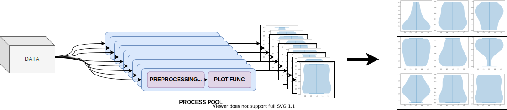

# Parallel generation of grid-like plots using matplotlib

This Python 3 module helps you speedup generation of subplots in pseudo-parallel mode using `matplotlib` and `multiprocessing`. This can be useful if you are dealing with expensive preprocessing or plotting tasks such as violin plots per subplot.



## How does it work?

This library uses pythons `multiprocessing` module to plot each cell individually. If provided, each process will first evaluate a user-defined preprocessing function. Afterwards, every process will call a second user-defined plotting function providing matplotlib axes to plot on. All created plots then stored as images and then retrieved and assembled by the main thread into a subplot without any decoration. 

## How do I install this module?

This module is in a very early stage, so no `pypi` releases are currently provided. However, you can simply install this module from git:
```bash
pip install git+https://github.com/paulgavrikov/parallel-matplolib-grid/
```

## How do I use it?

Aside from the data all you need to provide is the grid layout `grid_shape` and a plotting function `plot_fn`.
Here is an example:

```python
from parallelplot import parallel_plot

import matplotlib.pyplot as plt
import numpy as np


def violin(data, fig, axes):
    axes.violinplot(data)


# Gen some fake data 
X = np.random.uniform(low=-1, high=1, size=(30, 512, 512))

parallel_plot(plot_fn=violin, data=X, grid_shape=(3, 10))
plt.show()
```

Want to preprocess your data before plotting? No problem! just provide `preprocess_fn`.
Here is an example where we apply a PCA transformation:

```python
from parallelplot import parallel_plot

import matplotlib.pyplot as plt
import numpy as np
from sklearn.decomposition import PCA


def preprocess(data):
    return PCA().fit_transform(data)


def violin(data, fig, axes):
    axes.violinplot(data)


# Gen some fake data
X = np.random.uniform(low=-1, high=1, size=(30, 512, 512))

parallel_plot(plot_fn=violin, data=X, grid_shape=(3, 10), preprocessing_fn=preprocess)
plt.show()

```

## When should I *not* use this library?

There are some cases where this module is either useless or adds overhead. Here are a few of those:
- Your plot function and preprocessing functions execute fast, but your data is big. `multiprocessing` uses `pickle` as 
  input / output format of process tasks which requires data to be serialized. This can introduce a significant
  overhead.
- Your data is over 4 GiB big. For some reason `multiprocessing` is using some ancient `pickle` format that only supports
  data up to 4 GiB of size. There are ways to bypass that, but it's probably not worth it, as pickling is slow, and the
  computational overhead may not be worth it.
- You only have one core available. Sorry 'bout that.


## How do I contribute?

Just create a PR or feel free to raise an issue for questions, feature-requests etc. 
