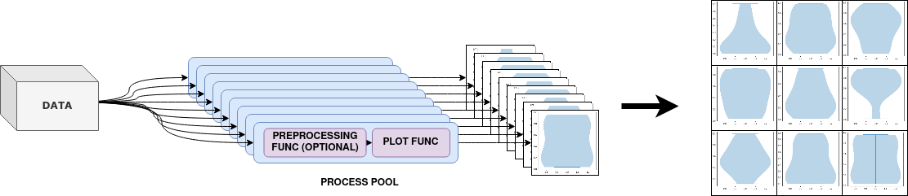

# Parallel generation of grid-like plots using matplotlib

This Python 3 module helps you generate subplots in parallel using matplotlib. This can be useful if you are dealing with expensive plotting tasks such as violinplots on a larger data corpus. It also allows you to pass a processing function for your input data that will be evaluated by every process before plotting. 



## How does it work?

This library uses the python multiprocessing module to plot each cell individually. If provided each process will first evaluate a user-defined preprocessing function. Afterwards, every process will call a user defined plotting function providing a matplotlib axis to plot on. As of now, all plots are then stored as images in a temporary directory on disk and then retrieved and assembled by the main thread into a subplot without any decoration. 

I am planning on adding support for in-memory plots or perhaps even passing the matplotlib figs tot the main thread if there is sufficient interest in this. 

## How do I install this module?

This module is in a very early stage, so no pypi releases are currently provided. However, you can simply install this library from git:
```bash
pip install git+https://github.com/paulgavrikov/parallel-matplolib-grid/
```

## How do I use it?

TBD


## How do I contribute?

Just create a PR or feel free to raise an issue for questions, feature-requests etc. 
